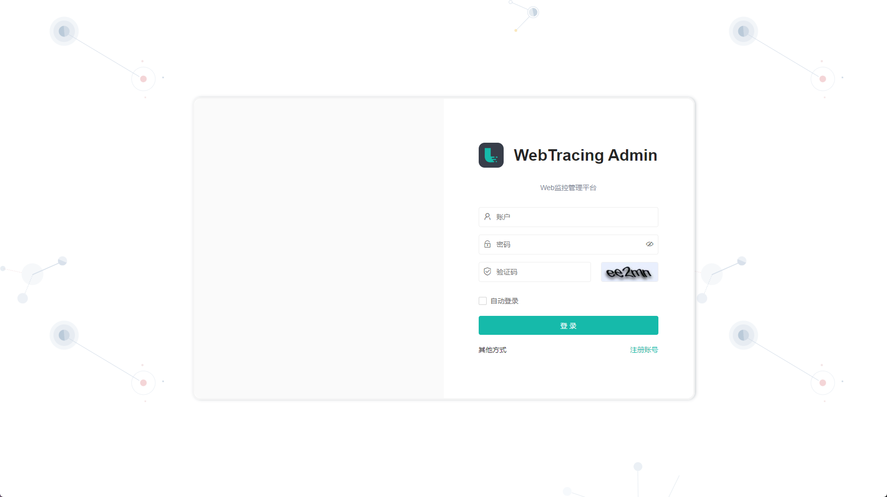
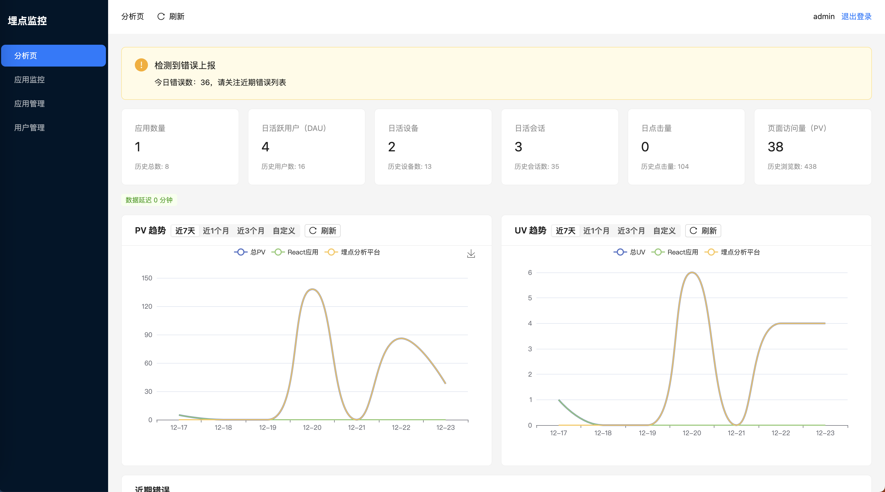
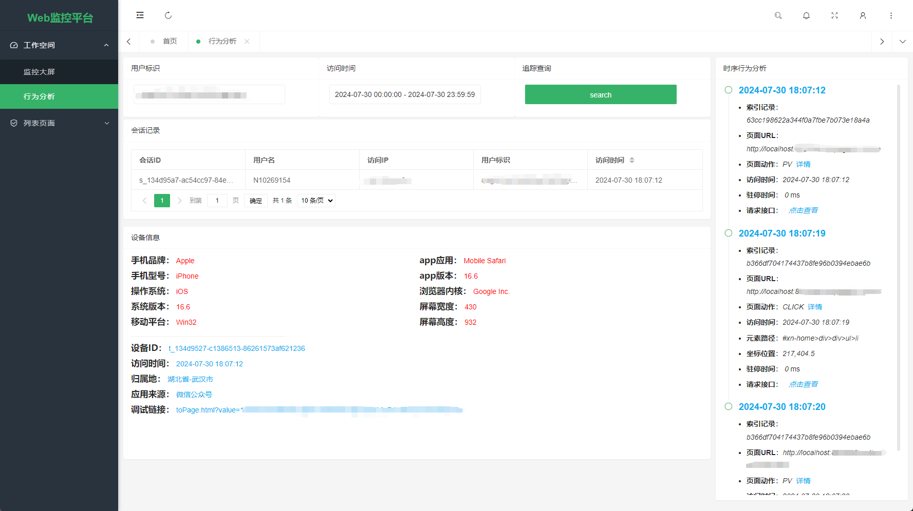
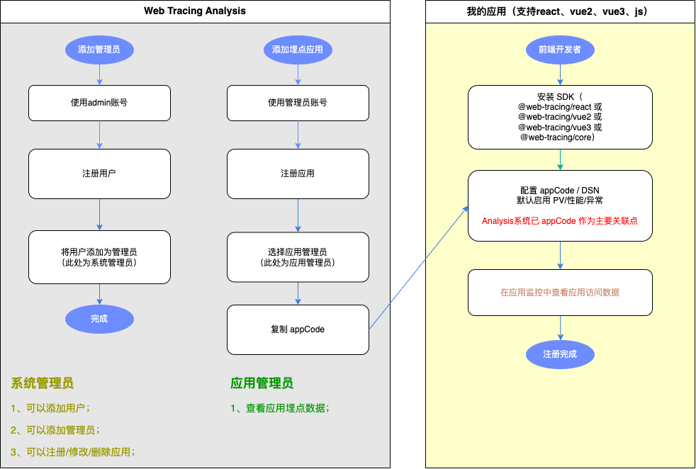

## web-tracing-analysis

基于 [web-tracing](https://github.com/M-cheng-web/web-tracing) 的 Web 前端观测与分析平台示例项目：覆盖性能、异常、请求、资源、路由、曝光、录屏与行为追踪，并提供可视化大屏与应用监控视图，帮助你快速把“采集 → 入库 → 查询 → 展示”串起来跑通。

### 项目特点
- 一体化链路：采集 SDK → 服务端落库（JPA/MySQL）→ 指标/明细查询 → 可视化展示
- 常见观测维度：性能、异常、请求、资源、路由、曝光、录屏、用户行为
- 大屏与应用监控：总览数据大屏 + 应用维度的监控与最近错误列表
- 轻量可演示：登录/鉴权/菜单使用静态数据，便于开箱体验与二次改造

### 版本信息
- 项目版本：`0.2.0`（`pom.xml`）
- Spring Boot：`3.5.9`（`pom.xml`）
- Java：`17`（`pom.xml`）
- 前端：React `18` + Vite `5`（`ui/package.json`）
- Docker 镜像：`boychina/web-tracing-analysis:latest`

### 功能状态与开发计划

#### 基础功能
| 功能 | 状态 |
| --- | --- |
| 用户注册及角色管理（支持多角色） | [x] 已完成 |
| 应用注册及权限管理（支持多应用） | [x] 已完成 |
| 首页状态看板（指标 + 状态标记） | [x] 已完成 |
| 应用访问趋势折线图（支持 PV/UV 趋势） | [x] 已完成 |
| 应用错误上报详细列表 | [x] 已完成 |
| 数据异常提示（标注原因） | [x] 已完成（基础版） |
| 埋点配置验证器（展示最近 10 条数据） | [x] 已完成 |
| 1 键数据验证按钮（模拟触发埋点） | [x] 已完成 |

#### 详细应用分析
目标：让用户 1 分钟内定位问题页面，而非只看报表

| 功能 | 位置 | 数据来源 | 状态 |
| --- | --- | --- | --- |
| 单应用页面访问分布 | 应用分析页 | `trace_event` | [x] 已完成（页面 PV 分布） |
| 错误详情下钻 | 应用分析页/错误详情 | `trace_event` | [x] 进行中（已支持 payload JSON 查看） |
| 单应用错误页面分布 | 应用分析页 | `trace_event` | [ ] 规划中（错误页面分布） |
| 会话路径分析（简化版） | 应用分析页 | `trace_event` | [ ] 规划中 |

#### 用户行为深度分析
目标：为 V1 的“数据可信”提供支撑

| 功能 | 位置 | 数据来源 | 状态 |
| --- | --- | --- | --- |
| 用户设备画像 | 用户分析页 | `base_info_record` | [ ] 进行中 |
| 埋点配置历史 | 埋点管理页 | 新增日志表 | [ ] 规划中 |
| 会话时长分析 | 应用分析页 | `trace_event` | [ ] 规划中 |
| 基于AI的错误分析和建议 | 应用分析页 | `trace_event` | [ ] 规划中 |

### 系统体验
- 访问地址：`http://127.0.0.1:17001/`
- 默认账号：

| 账号 | 密码 |
| --- | --- |
| admin | admin |

### 本地运行
- 准备数据库：MySQL `8.x`（或使用下方 Docker 方式启动）
- 配置环境变量（示例）：
  - `export SPRING_DATASOURCE_URL='jdbc:mysql://127.0.0.1:3306/web_tracing?createDatabaseIfNotExist=true&useUnicode=true&characterEncoding=UTF-8&useSSL=false&serverTimezone=UTC&allowPublicKeyRetrieval=true'`
  - `export SPRING_DATASOURCE_USERNAME='root'`
  - `export SPRING_DATASOURCE_PASSWORD='123456'`
- 构建并启动：
  - `./mvnw -DskipTests clean package`
  - `java -jar target/web-tracing-analysis.jar`

### 前端开发（可选）
- 安装依赖：`pnpm -C ui install`
- 本地启动：`pnpm -C ui dev`
- 构建产物：`pnpm -C ui build`

### 界面预览

### 应用注册数据上报

### 压力测试

使用服务端压测端点 `/stressRun` 进行并发压测，结果如下：

| 指标 | 数值 |
| ---- | ---- |
| 并发用户数 | 100 |
| 循环次数 | 5000 |
| 成功数 | 5000 |
| 失败数 | 0 |
| 总耗时(ms) | 5329 |
| QPS | 938.26 |
| p50 响应时间(ms) | 88 |
| p90 响应时间(ms) | 180 |
| p99 响应时间(ms) | 374 |

### 容器化部署

#### 方式一：使用 Docker Compose 一键部署（推荐）
- 启动：
  - `docker compose up -d`
- 说明：
  - 默认会启动 `mysql` 与 `web-tracing-analysis` 两个服务
  - 服务端通过 `SPRING_DATASOURCE_*` 环境变量连接 `mysql`（服务名），默认数据库：`web_tracing`
  - MySQL 端口映射默认是 `3307:3306`，避免和本机 MySQL 冲突
- 验证：
  - `docker compose ps`
  - `docker compose logs -f web-tracing-analysis`
  - 浏览器访问：`http://127.0.0.1:17001/`

#### 方式二：直接拉取镜像运行
镜像获取路径：
- `docker pull boychina/web-tracing-analysis:latest`

最小运行示例（自建网络 + MySQL + 应用）：
- `docker network create web-tracing-net`
- `docker run -d --name wta-mysql --network web-tracing-net -e MYSQL_ROOT_PASSWORD=123456 -p 3307:3306 mysql:8.4`
- `docker run -d --name web-tracing-analysis --network web-tracing-net -p 17001:17001 -e SPRING_DATASOURCE_URL='jdbc:mysql://wta-mysql:3306/web_tracing?createDatabaseIfNotExist=true&useUnicode=true&characterEncoding=UTF-8&useSSL=false&serverTimezone=UTC&rewriteBatchedStatements=true&useServerPrepStmts=true&cachePrepStmts=true&useCursorFetch=true&defaultFetchSize=1000&allowPublicKeyRetrieval=true' -e SPRING_DATASOURCE_USERNAME=root -e SPRING_DATASOURCE_PASSWORD=123456 -e SERVER_PORT=17001 boychina/web-tracing-analysis:latest`
- 访问：`http://127.0.0.1:17001/`

常用排障：
- `docker logs -f web-tracing-analysis`
- 如 MySQL 镜像拉取失败或启动异常，建议改用 `mysql:8.0` / `mysql:8.4` 等稳定版本

## 许可证

本项目采用 Apache License 2.0 许可。详情参见[LICENSE](LICENSE)文件。

## 致谢
- [web-tracing](https://github.com/M-cheng-web/web-tracing) 为前端项目提供【 埋点、行为、性能、异常、请求、资源、路由、曝光、录屏 】监控手段。web-tracing文档地址：https://m-cheng-web.github.io/web-tracing/
- [hutool](https://gitee.com/dromara/hutool) 优秀的，开源的，小而全的Java工具类库，使Java拥有函数式语言般的优雅，让Java语言也可以“甜甜的”。
- [JetBrains Open Source](https://www.jetbrains.com/zh-cn/opensource/?from=archery)
